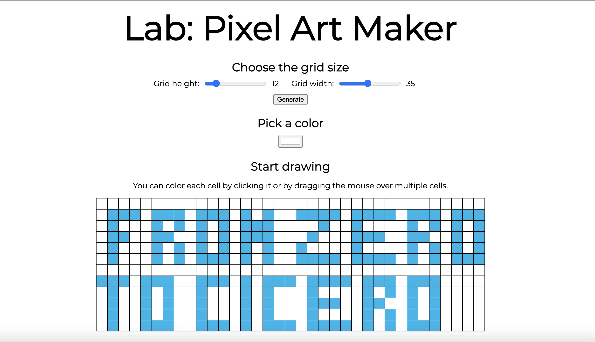

# Pixel Art Maker Project - Revisited

This project has been created as part of the Udacity Developer Course JavaScript section, which I attended in 2017.

The idea of the project was to create a table-like canvas, in which the user can color each cell with any color that he wants from a color picker. Technologies that you were supposed to use were HTML, CSS and JavaScript (jQuery optional).

As a 2021 revisit and upgrade, I've made some changes to the source code:

- Remove jQuery and use VanillaJS instead;
- Changed input numbers to range sliders (to prevent the user from entering ridiculous grid numbers);
- Added CSS classes instead of applying styles on HTML tags;
- Converted JavaScript code to ES6 arrow functions;
- Added color functionality on click drag, rather than just on click.
